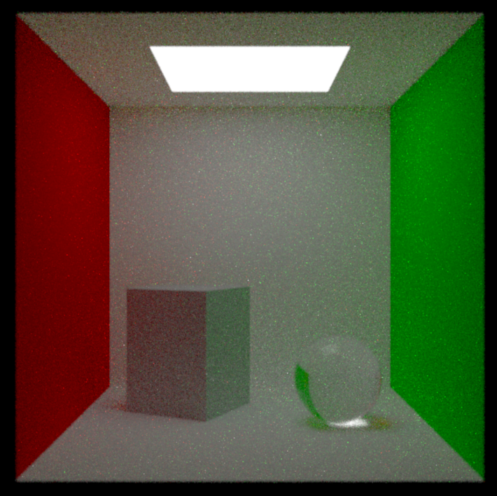
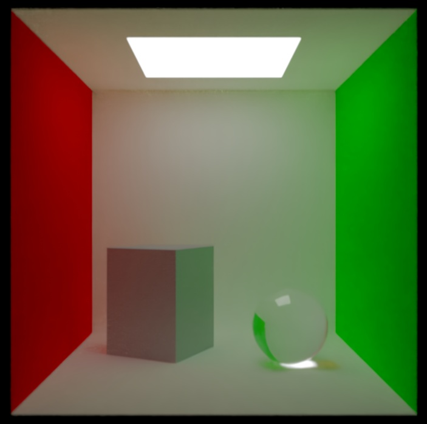

# Path Tracer

Path tracing is a form of ray-tracing where light rays are simulated backwards from camera till it reaches a light source. It simulates the probabilistic behaviour of light very accurately using multiple samples. Increasing number of samples will increase the accuracy of the image but will also take more time to render. Due to the probabilistic nature of a Path tracer, it is common to use a denoising filter at the end to get a smoother image.

## Using the program

```
git clone https://github.com/elbertronnie/path-tracer.git
cd path-tracer
cargo run
```

A cornell box will start to be rendered. This demo progressively increases the sample count to visualize the gradual formation of the image. Mouse and Keyboard can be used to naviagte the 3D space but it will restart the sample count. The performance of the renderer might be very slow on old GPUs currently since BVH optimizations have not been implemented yet.

## Images

### With 100 samples



### With 1000 samples


### With 1000 samples and denoising filter



## Implementaion Status

### Features

- [x] Antialiasing
- [x] Defocus Blur
- [x] Importance Sampling
- [ ] Motion Blur
- [ ] BVH Optimization

Every object comprises of a geometry and a material. The geometry is the shape of the object and is used to decide if a light ray will hit it or not. A material decides how light ray will interact with it once it hits the surface.

### Geometries

- [x] Sphere
- [x] Parallelogram
- [ ] Triangle
- [ ] Circle
- [ ] Cone

### Materials

- [x] Lambertian
- [x] Metallic
- [x] Dielectric
- [x] Light

